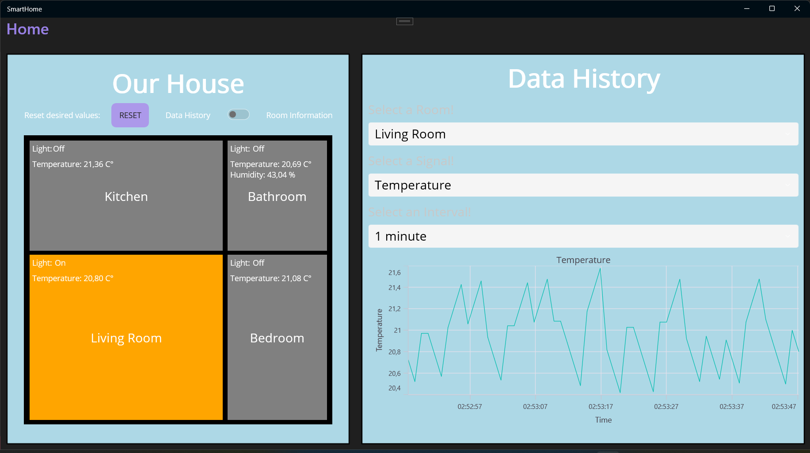
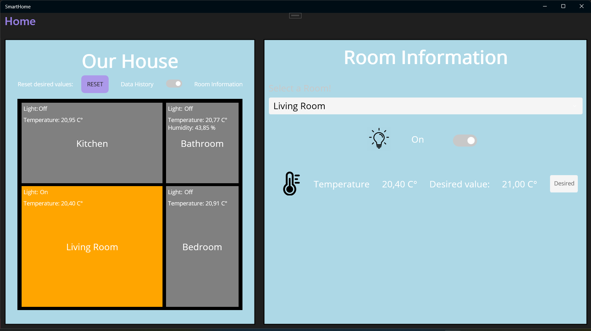

# Smart home project

The project is a MAUI application containing some advanced technologies.

### Authors
- Kósa György Máté
- Trombitás Zalán
- Langer Ákos  

### Techniques
- MVVM architecture
- Task and async-await usage
- Entity Framework usage
- HTTP communication with different HTTP methods
- Data binding
- IValueConverter usage
- ICommand
- StaticResource usage
- Linq
- Serialization to JSON  format
- Drawing chart with Syncfusion
- Using design patterns
  - Singletone - DataProvider.cs
  - Observer - DataProvider.cs (Publisher), HistoryModel.cs (Subcriber), BarcelonaHomeModel.cs (Subcriber)
  - Builder - RoomModel.cs
- Dependency Injection framework

## Appearance

History screen

Rooms details

